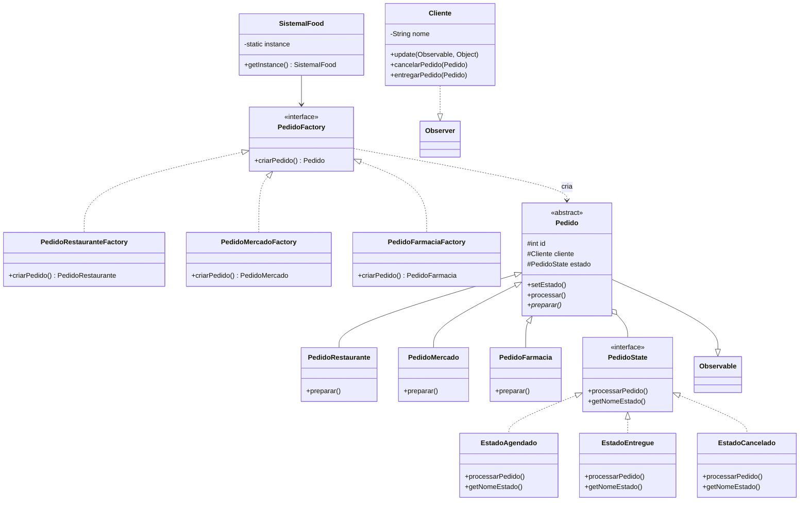
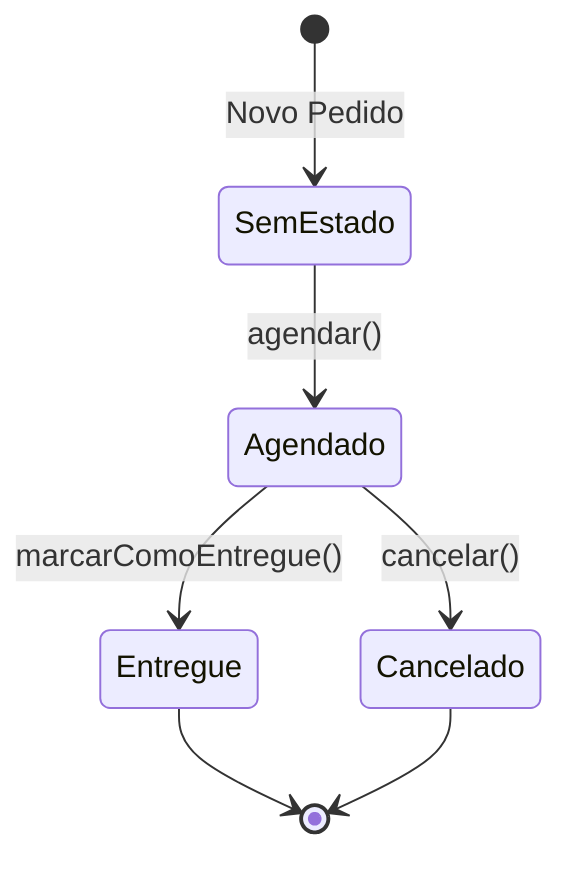

# Atividade-8

## 1. Padrão Singleton

O `SistemaIFood.java`: Implementa o padrão Singleton

- Construtor privado
- Variável estática `instance`
- Método `getInstance()` para acessar a instância

## 2. Padrão Factory Method

O `PedidoFactory.java`: Implementa o padrão Factory Method 

- Interface base com método `criarPedido()`
- Factories concretas:
  - `PedidoRestauranteFactory`
  - `PedidoMercadoFactory`
  - `PedidoFarmaciaFactory`

## 3. Padrão State

O padrão State é implementado através de:

- `PedidoState.java`: Interface que define o comportamento comum para todos os estados
- Estados concretos:
  - `EstadoAgendado.java`: Quando o pedido está agendado
  - `EstadoEntregue.java`: Quando o pedido foi entregue
  - `EstadoCancelado.java`: Quando o pedido foi cancelado

Cada estado implementa:
- Sua própria lógica no método `processarPedido()`
- O método `getNomeEstado()` para identificação
- A classe `Pedido` contém uma referência ao estado atual e delega o comportamento

## 4. Padrão Observer

Implementado usando a API Java padrão:
- `java.util.Observable`: Estendida pela classe `Pedido`
- `java.util.Observer`: Implementada pela classe `Cliente`
- Notificações automáticas quando o pedido muda de estado

## Fluxo de funcionamento

O sistema implementa um fluxo de pedidos com as seguintes etapas:

1. **Criação do Pedido**
    - Obtém instância única do `SistemaIFood`
    - Utiliza factory específica para criar o tipo de pedido
    - Associa o pedido a um cliente

2. **Gerenciamento de Estado**
   - Pedido inicia sem estado definido
   - Agendamento define data e hora futura
   - Preparação específica por tipo:
     - Restaurante: Gerencia observações da cozinha
     - Mercado: Controla necessidade de embalagem especial
     - Farmácia: Valida receitas médicas quando necessário

3. **Transições de Estado**
   - SemEstado → Agendado (via `agendar()`)
   - Agendado → Entregue (via `marcarComoEntregue()`)
   - Agendado → Cancelado (via `cancelar()`)
   - Cliente é notificado automaticamente das mudanças

4. **Finalização**
   - Estados finais: Entregue ou Cancelado
   - Sistema mantém histórico dos pedidos
   - Não permite transições após estados finais

## Diagrama de Classe do Projeto

## Diagrama de Estado

