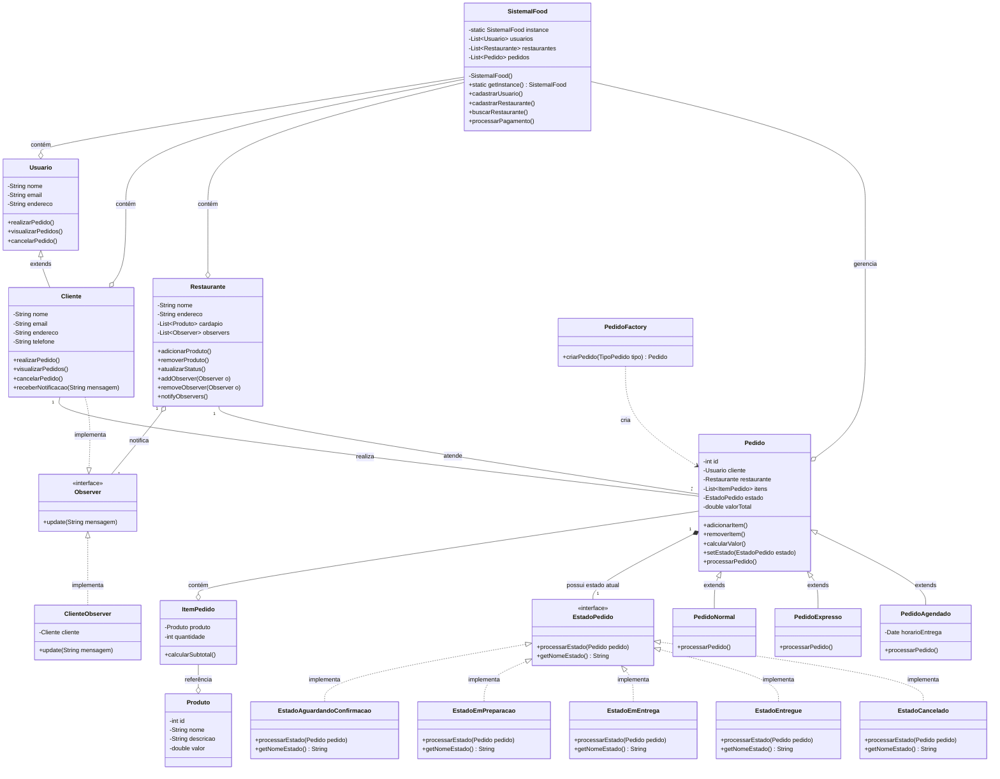

# Atividade-8

## 1. Padrão Singleton

SistemaIFood.java: Implementa o padrão Singleton garantindo que exista apenas uma instância do sistema central

Construtor privado
Variável estática instance
Método getInstance() para acessar a instância única

## 2. Padrão Factory Method

PedidoFactory.java: Implementa o padrão Factory Method para criar diferentes tipos de pedidos

criarPedido() retorna diferentes tipos de pedidos baseados no parâmetro tipo
Classes concretas: PedidoComida e PedidoMercado

## 3. Padrão State

EstadoPedido.java: Interface que define o comportamento comum para todos os estados
Estados concretos que implementam diferentes comportamentos:

PedidoEmAndamento.java: Estado quando o pedido está sendo processado
PedidoEntregue.java: Estado quando o pedido foi entregue com sucesso
PedidoCancelado.java: Estado quando o pedido foi cancelado

Cada estado implementa sua própria lógica no método processarPedido()
A classe Pedido contém uma referência ao estado atual e delega o comportamento

## 4. Padrão Observer

O padrão Observer é implementado usando a API Java padrão (java.util.Observable e java.util.Observer)
Cliente.java: Implementa a interface Observer para receber notificações
Pedido.java: Estende Observable para notificar os observadores sobre mudanças de estado
Quando um pedido muda de estado, ele notifica automaticamente os clientes registrados

Outras Classes Importantes

Restaurante.java e Mercado.java: Representam os estabelecimentos do sistema
Produto.java e ItemPedido.java: Representam os produtos e itens dos pedidos

## Fluxo de funcionamento

Quando o sistema é executado, você verá como os pedidos são criados, processados, e como os clientes recebem notificações automáticas sobre as mudanças de estado. A estrutura do código segue os princípios de design patterns e orientação a objetos, proporcionando um sistema flexível e extensível.
Ao executar o programa, o fluxo será:

Criar clientes, restaurantes e mercados
Cadastrar produtos nos estabelecimentos
Criar pedidos usando o padrão Factory Method
Processar pedidos, demonstrando as transições de estado (padrão State)
Mostrar como os clientes recebem notificações (padrão Observer)
Exibir um resumo dos pedidos de cada cliente

## Diagrama

